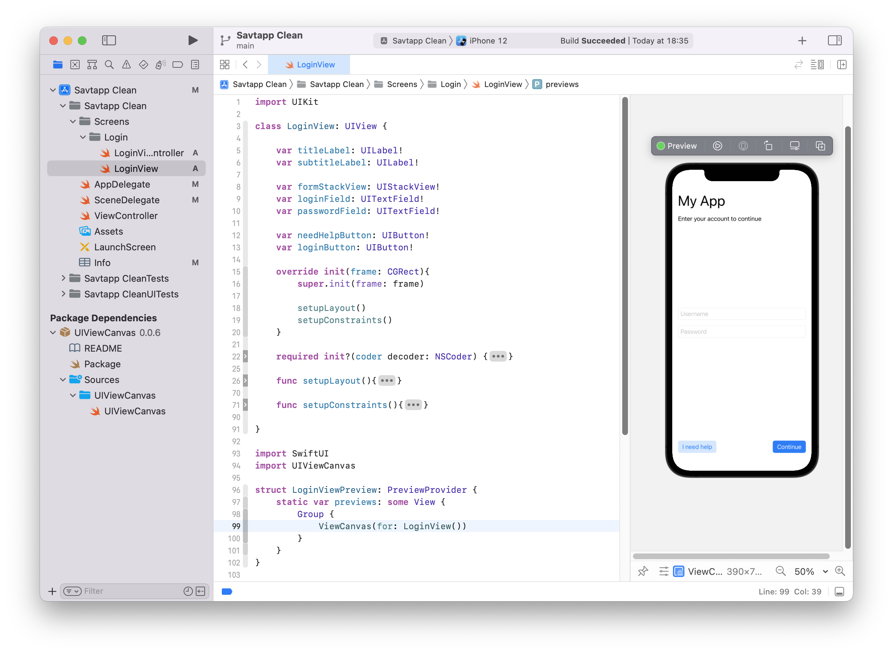

# UIViewCanvas

This package allows you to enable a SwiftUI Xcode canva to a UIView or a entire ViewController.



## Why?

Run emulator everytime you need to test a small change in your View is painfull.

## Requirements

&check; Xcode 11+ <br>
&check; Swift 4.2+ <br>
&check; iOS 13+ project <br>

## How to use?

### Step 1
Select your project on Xcode and go to `Files` > `Add Packages` and paste this repository URL `https://github.com/outrowender/UIViewCanvas` on search field.

Select a version and click `Install`.

### Step 2
Add the previewer to your view file:

```swift
import SwiftUI
import UIViewCanvas

struct MyPreview: PreviewProvider {
    static var previews: some View {
        //Text("Example preview")
    }
}
```  

Now you can instantiate your View as a SwiftUI component:

```swift
struct MyPreview: PreviewProvider {
    static var previews: some View {
        ViewCanvas(for: MyCustomView())
        // or //ViewControllerCanvas(for: MyViewController())
    }
}
```  

If you want a better preview, check `Group` component and use a `.previewLayout` to set a custom canvas to your preview.

```swift
struct MyPreview: PreviewProvider {
    static var previews: some View {
        Group{
            ViewControllerCanvas(for: MyViewController())
        }.previewLayout(.fixed(width: 350, height: 350))
    }
}
```

### Step 3
Run `⌥ + ⌘ + p` to resume your canvas.

## Credits

This package was a insight that I got from a @bhlvoong video.
